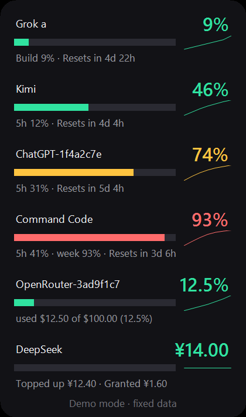
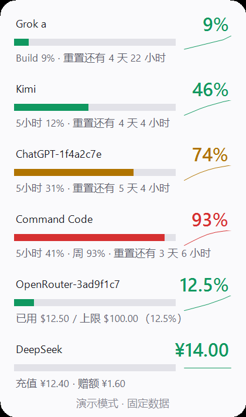
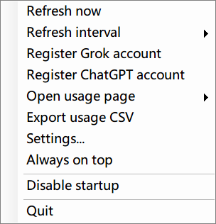

# AI Usage Widget

[](https://github.com/Regine88/ai-usage-widget/actions/workflows/ci.yml)
[](LICENSE)
[](#requirements)

A small always-on desktop card that shows the **weekly usage** of several AI services side by side.
Pure PowerShell + WinForms, no third-party dependencies, no admin rights, and nothing is uploaded anywhere.

English · [简体中文](README.md)



> The screenshot is produced by `-Demo` mode: fixed sample data, no real credentials, no state file writes, no network access.

The light theme uses the same layout (switch in the settings dialog, or run with `-Theme light`):



## Supported providers

| Provider | What the card shows | Accounts | Credential source |
| --- | --- | --- | --- |
| **Grok** | Weekly usage per product (Build / Chat / ...) and reset time | Multi-account, one row each | `~/.grok/auth.json` |
| **Kimi** | 5-hour and weekly window usage | Single account | `~/.kimi-code/credentials/kimi-code.json` |
| **ChatGPT / Codex** | 5-hour and weekly window usage | Multi-account, one row each | `~/.codex/auth.json` |
| **Gemini / Antigravity** | Quota percentage and reset time | Single account | Windows Credential Manager `gemini:antigravity` |
| **Command Code** | Daily / 5-hour / weekly rolling windows, optional balance | Single account | `~/.commandcode/auth.json` |
| **OpenRouter** | Spent credits and the key's spend limit (says so when unlimited) | One row per key | `~/.openrouter/auth.json` or `$env:OPENROUTER_API_KEY` |
| **DeepSeek** | Account balance with the topped-up / granted breakdown (no percentage) | Single account | `~/.deepseek/auth.json` or `$env:DEEPSEEK_API_KEY` |

If you already signed in to the matching CLI (Grok CLI, `kimi`, Codex CLI, Command Code CLI, Antigravity)
there is nothing else to configure: the widget reuses those credentials read-only and only writes back
when a token needs refreshing. OpenRouter and DeepSeek are API-key only: the widget reads
`~/.openrouter/auth.json` (or `$env:OPENROUTER_API_KEY`) for one row per key, and
`~/.deepseek/auth.json` (or `$env:DEEPSEEK_API_KEY`) to show the account balance instead of a percentage.

## Features

- **Everything in one card** - a rounded, always-on card; Grok and ChatGPT expand to one row per account.
- **Dark / light themes** - switch in the settings dialog or per run with `-Theme dark|light`; every colour comes from a single palette, and window opacity is adjustable (0.5 - 1.0).
- **Out of the way** - draggable, snap-to-edge, optional always-on-top, position and settings remembered.
- **Tray icon** - double-click to show or hide; closing the window exits and releases the single-instance mutex.
- **Threshold alerts** - configurable used-percent thresholds (70% and 90% by default), automatically re-armed after the quota resets; quiet hours supported.
- **Double-click to open** - double-click any row to jump to that provider's official usage page.
- **Trend sparkline** - a 7-day mini chart next to each progress bar, colored by current usage.
- **Exhaustion forecast** - the tooltip estimates when the quota runs out and whether that happens before the next reset.
- **Central settings** - the settings dialog writes `ai-config.json` (providers, interval, theme, opacity, thresholds, quiet hours), applied live on save, and the full history exports to CSV.
- **Graceful degradation** - one slow provider only affects its own row and backs off exponentially (30s up to 15min).
- **Local first** - account snapshots are protected with Windows DPAPI, logs are redacted, accounts appear only as short hashes.
- **Two engines** - works on Windows PowerShell 5.1 and PowerShell 7.x; CI runs the same offline suites on both.
- **Offline verification** - `-Demo` renders fixed data, ideal for screenshots and for telling UI bugs apart from credential bugs.
- **Update check** - the About dialog shows the version, licence and project link, and checks GitHub for the latest release; a newer release brings its summary and a download button.

## Using the card

| Action | Result |
| --- | --- |
| Drag the card or its status line | Moves the window, snapping to screen edges |
| Double-click a row | Opens that provider's usage page |
| Press `F5` | Refresh every provider now |
| Double-click the tray icon | Show or hide the card |
| Right-click the card | Opens the menu (see below) |
| Hover a row | Shows a tooltip with details, reset time and the exhaustion forecast |
| Right-click, **Export usage CSV** | Writes the whole history to `ai-usage-<timestamp>.csv` in the app directory (UTF-8, opens in Excel) |



The menu contains: refresh now, refresh interval (1 / 5 / 15 / 60 minutes), register Grok account,
register ChatGPT account, open usage page (Grok / Gemini / Kimi / ChatGPT / Command Code / OpenRouter / DeepSeek),
export usage CSV, settings, about, always on top, run at startup, quit.

## Quick start

### Requirements

| Item | Requirement |
| --- | --- |
| OS | Windows 10 / 11 (WinForms and DPAPI) |
| PowerShell | Windows PowerShell 5.1 (built in) or PowerShell 7.x |
| Privileges | No admin rights, no registry writes |
| Dependencies | None, nothing to install |

### Clone and run

```powershell
git clone https://github.com/Regine88/ai-usage-widget.git
cd ai-usage-widget

# Option 1: run directly (add -ExecutionPolicy Bypass to avoid policy blocks)
pwsh -NoProfile -ExecutionPolicy Bypass -File .\AiUsageWidget.ps1

# Option 2: launch without a console window (same as double-clicking)
wscript.exe .\Start-AiUsageWidget.vbs
```

Just want to see the UI? No account is needed:

```powershell
pwsh -NoProfile -File .\AiUsageWidget.ps1 -Demo
```

### Install locally

```powershell
# Install from a clone (run again to upgrade)
powershell -NoProfile -ExecutionPolicy Bypass -File .\install.ps1

# Status / uninstall (keeps user data) / full removal
.\install.ps1 -Status
.\install.ps1 -Uninstall
.\install.ps1 -Uninstall -Purge
```

The installer copies the runtime files to `%LOCALAPPDATA%\Programs\AIUsageWidget` and adds a
Start menu shortcut. User data such as `ai-config.json` and `ai-history.jsonl` is never
overwritten, and uninstalling keeps it by default. Prefer no installer? Just double-click
`Start-AiUsageWidget.vbs`.

You can also install from a Release archive:

```powershell
.\install.ps1 -Zip .\ai-usage-widget-0.10.0.zip
```

Scoop users can install the manifest attached to every Release:

```powershell
scoop install https://github.com/Regine88/ai-usage-widget/releases/latest/download/ai-usage-widget.json
```

### Check the version

```powershell
pwsh -NoProfile -File .\AiUsageWidget.ps1 -Version
# AI Usage Widget 0.10.0
```

### Multiple accounts

Grok and ChatGPT / Codex render one row per account:

1. Sign in with the matching CLI for the first account.
2. Right-click the card and pick **register Grok account** / **register ChatGPT account**.
3. Switch to another account and repeat; a new row appears automatically.

Registered accounts are stored as DPAPI-protected snapshots in `%LOCALAPPDATA%\AIUsageWidget\accounts\`,
named after a short account hash and never containing the email address.

Row names default to that short hash (for example `Grok-1f4a2c7e`). To use `a` / `b` style names instead,
drop a `grok-aliases.json` file into the app directory with content like `{ "Grok-1f4a2c7e": "a" }`
(the key is the fingerprint shown in the row name). Aliases stay local: the file is already covered by
`.gitignore` and is never published with the repository.

### Run at startup

Right-click the card and choose the startup item (click again to disable). It only drops a shortcut to
`Start-AiUsageWidget.vbs` into your own Startup folder - no registry entries, no admin rights.

## Command line switches

| Switch | Effect |
| --- | --- |
| *(none)* | Start the card normally; a second instance will not start |
| `-Version` | Print the version and exit |
| `-Demo` | Demo mode: fixed rows, no credentials, no state writes, no network, no history or alerts |
| `-Install` | Register the startup shortcut and exit |
| `-Uninstall` | Remove the startup shortcut and exit |
| `-AddAccount` | Register the current `~/.codex/auth.json` as an account |
| `-AddGrokAccount` | Register the current `~/.grok/auth.json` as an account |
| `-MigrateSecrets` | Move legacy in-project snapshots into the DPAPI store |
| `-IntervalSeconds <n>` | Refresh interval in seconds (minimum 15, default 300, overridden by the menu choice) |
| `-Theme <dark\|light>` | Force the dark or light palette for this run only; `ai-config.json` is left untouched |

## Configuration (`ai-config.json`)

Right-click the card and pick **Settings…**; saving writes `ai-config.json` next to the script.
You can also edit the file directly and restart the widget. It is covered by `.gitignore`
and never published with the repository.

| Field | Default | Meaning |
| --- | --- | --- |
| `intervalSeconds` | `300` | Refresh interval in seconds (15 - 86400) |
| `opacity` | `0.96` | Window opacity (0.5 - 1.0) |
| `theme` | `"dark"` | UI theme: `dark` / `light`, applied live when saved from the settings dialog |
| `showTrend` | `true` | Draw the 7-day sparkline next to each progress bar |
| `showForecast` | `true` | Include the exhaustion forecast in the tooltip |
| `trendDays` | `7` | Days used by the sparkline and the forecast (1 - 14) |
| `alertThresholds` | `[70, 90]` | Used-percent values that trigger a tray balloon, sorted and de-duplicated |
| `quietHours` | `{ "enabled": false, "start": "22:00", "end": "07:00" }` | Quiet hours; ranges crossing midnight are handled |
| `providers` | all `true` | Per-provider switches: `grok` / `gemini` / `kimi` / `codex` / `commandcode` / `openrouter` / `deepseek` |
| `language` | `"auto"` | UI language: `auto` (follow the system) / `zh-CN` / `en-US` |

Invalid values (out of range, wrong type, malformed clock time) fall back to the defaults,
so a broken file can never break the widget.

### Interface language

- `language` accepts `auto` (follow the system UI language: Chinese systems use Simplified Chinese, everything else uses English),
  `zh-CN` and `en-US`. The **Language** selector in the settings dialog writes this field, and changes take effect **after a restart**.
- All strings live in `strings/zh-CN.json` and `strings/en-US.json` inside the program folder; values may use `{0}` placeholders filled in by the code.
- If a pack is missing or its JSON is broken the widget falls back to a built-in table, so the UI never goes blank;
  a missing key shows its own name, which makes untranslated strings easy to spot.
- Adding a language takes two edits: copy `strings/en-US.json` to `strings/<language>.json` and translate the values,
  then register the language code in `$script:WidgetStringLanguages` inside `WidgetStrings.ps1`.
  Language codes are a whitelist, so a value from the config file is never used as a file name directly.

## Data and privacy

| Data | Location | Contains credentials |
| --- | --- | --- |
| Account snapshots (DPAPI) | `%LOCALAPPDATA%\AIUsageWidget\accounts\` | Encrypted; file names are hashes |
| UI state (position / top-most / interval) | `<app dir>\ai-state.json` | No |
| Usage history | `<app dir>\ai-history.jsonl` | No, timestamps and percentages only |
| Request events | `<app dir>\ai-request-events.jsonl` | No, provider / model / status / duration only |
| Account aliases (optional) | `<app dir>\grok-aliases.json` | No, short hashes and local aliases only; covered by `.gitignore` |
| Install metadata (optional) | `<install dir>\ai-install.json` | No, version, install time and file list only |
| Log | `<app dir>\ai-widget.log` | No, accounts appear as short hashes; rotated automatically |

- Requests go only to each provider's own endpoints, always over HTTPS, and only after a trusted-host check.
- No telemetry, no analytics, no update callbacks: nothing is ever sent to this project's maintainer.
- See [SECURITY.md](SECURITY.md) for the full security design.

## Development

```powershell
# Run every offline suite on both PowerShell versions (each prints ALL PASSED on success)
$ps51 = Join-Path $env:WINDIR 'System32\WindowsPowerShell\v1.0\powershell.exe'
foreach ($exe in @('pwsh', $ps51)) {
    Get-ChildItem -Filter 'test-*.ps1' | Sort-Object Name | ForEach-Object {
        $out = & $exe -NoProfile -ExecutionPolicy Bypass -File $_.FullName 2>&1 | Out-String
        '{0,-32} {1}' -f $_.Name, $(if ($LASTEXITCODE -eq 0 -and $out -match 'ALL PASSED') { 'PASS' } else { 'FAIL' })
    }
}
```

Use `-Demo` for visual regressions of the UI, and add offline tests for parsing and validation logic
(no network, no real accounts). Module boundaries, the worker contract and the steps to add a provider
are documented in [docs/architecture.md](docs/architecture.md) and [docs/providers.md](docs/providers.md).

### Project layout

```text
AiUsageWidget.ps1        Main program: UI, menu, timer, background fetch scheduling
UsageValidation.ps1      Shared validation and redaction helpers
SecureSnapshot.ps1       DPAPI protected account snapshots
ApiKeyAuth.ps1           API-key credential reading and authed requests (shared by OpenRouter / DeepSeek)
GrokAccounts.ps1         Grok multi-account support
GeminiAntigravity.ps1    Gemini / Antigravity quota
KimiQuota.ps1            Kimi payload parsing
CommandCodeQuota.ps1     Command Code quota parsing
OpenRouterQuota.ps1      OpenRouter key quota parsing
DeepSeekQuota.ps1        DeepSeek balance parsing
WidgetUpdates.ps1         Version comparison and GitHub release parsing
ModelRequestRecorder.ps1 Request event recording (metadata only)
UsageHistory.ps1         History aggregation, trends, exhaustion forecast, CSV export
WidgetConfig.ps1         ai-config.json read/write and validation
WidgetPalette.ps1        Dark / light palette (single source of UI colours)
WidgetStrings.ps1        Language pack loading and string lookup
strings/                 Language packs (zh-CN.json / en-US.json)
WidgetInstaller.ps1      Install / upgrade / uninstall implementation
install.ps1              Installer entry point
tools/                   Release packaging script
Record-ModelRequest.ps1  Standalone entry point for recording events
test-*.ps1               Offline test suite per module
Start-AiUsageWidget.vbs  Windowless launcher
docs/                    Architecture, provider, troubleshooting docs and screenshots
```

## Documentation

- [Architecture](docs/architecture.md): process and thread model, data flow, row contract, storage layout
- [Providers](docs/providers.md): data source per provider and the seven steps to add a new one
- [Troubleshooting](docs/troubleshooting.md): missing card, expired login, timeouts, DPI, startup issues
- [Changelog](CHANGELOG.md) · [Contributing](CONTRIBUTING.md) · [Security](SECURITY.md) · [Code of Conduct](CODE_OF_CONDUCT.md)

## Contributing

Issues and pull requests are welcome: new providers, more themes and layout modes (mini / multi-column),
and packaging are all on the roadmap. Please read [CONTRIBUTING.md](CONTRIBUTING.md) first - it covers the
testing requirement (both PowerShell versions) and the security ground rules (never commit credentials,
logs or files containing personal data).

## License and disclaimer

Released under the [MIT License](LICENSE).

This is an **unofficial** tool. It is not affiliated with or endorsed by Grok / xAI, Kimi / Moonshot,
OpenAI, Google, Command Code, OpenRouter or DeepSeek. It only reads the credentials already present on your machine to display
quota information and never bypasses any paywall, rate limit or authorization mechanism; make sure your
use complies with each service's terms.
