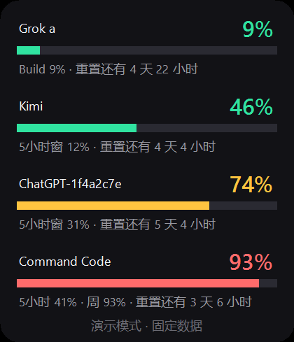
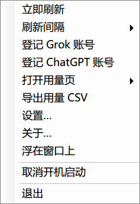

# AI Usage Widget · AI 周用量

[](https://github.com/Regine88/ai-usage-widget/actions/workflows/ci.yml)
[](LICENSE)
[](#环境要求)

把多个 AI 服务的**每周用量**并排显示在一个桌面小卡片里。纯 PowerShell + WinForms，无第三方依赖，
不需要管理员权限，不向任何服务器上传数据。

[English](README.en.md) · 简体中文



> 截图由 `-Demo` 模式生成：固定演示数据，不读取任何真实账号，不写状态文件，也不联网。

## 支持的供应商

| 供应商 | 卡片显示 | 账号模式 | 凭证来源 |
| --- | --- | --- | --- |
| **Grok** | Build / Chat 等产品的周用量与重置时间 | 多账号，每个账号一行 | `~/.grok/auth.json` |
| **Kimi** | 5 小时窗与周窗口的用量 | 单账号 | `~/.kimi-code/credentials/kimi-code.json` |
| **ChatGPT / Codex** | 5 小时窗与周窗口的用量 | 多账号，每个账号一行 | `~/.codex/auth.json` |
| **Gemini / Antigravity** | 配额百分比与重置时间 | 单账号 | Windows 凭据管理器 `gemini:antigravity` |
| **Command Code** | 日 / 5 小时 / 周滚动窗口，可选余额 | 单账号 | `~/.commandcode/auth.json` |
| **OpenRouter** | 密钥的已用额度与上限（未设上限时明确说明） | 每个密钥一行 | `~/.openrouter/auth.json` 或 `$env:OPENROUTER_API_KEY` |

已经登录过对应 CLI（Grok CLI、`kimi`、Codex CLI、Command Code CLI、Antigravity）就不会有额外配置负担：
卡片直接复用它们的凭证，只读不写（令牌过期时才会原地刷新）。OpenRouter 是纯 API-key 供应商：读取 `~/.openrouter/auth.json`（或 `$env:OPENROUTER_API_KEY`），每个密钥一行。

## 特性

- **一个窗口看全部**：暗色圆角卡片，Grok 与 ChatGPT 会按账号展开成多行。
- **不打断工作**：常驻桌面、可置顶、拖拽移动、贴边吸附，位置与设置自动记忆。
- **托盘常驻**：双击托盘图标显示 / 隐藏卡片；关闭窗口即退出并释放单实例互斥。
- **阈值提醒**：用量达到 70% 与 90% 时弹一次气泡提醒，用满后自动重置提醒状态。
- **双击直达**：双击任意一行直接打开该服务的官方用量页面。
- **趋势可视**：每行进度条右侧画出最近 7 天迷你折线，颜色跟随当前用量（绿 / 黄 / 橙 / 红）。
- **耗尽预测**：悬停提示按最近趋势估算额度耗尽时间，并提示是否早于本次重置。
- **集中设置**：设置窗口写入 `ai-config.json`（供应商开关、刷新间隔、不透明度、阈值、静音时段），历史可一键导出 CSV。
- **失败可降级**：单个供应商超时或报错只影响自己那一行，并进入指数退避（30 秒起，最长 15 分钟）。
- **本地优先**：账号快照用 Windows DPAPI 加密，日志与错误文本统一脱敏，账号只以短哈希出现。
- **双引擎可用**：Windows PowerShell 5.1 与 PowerShell 7.x 都支持，CI 双版本跑同一套离线测试。
- **可离线验证**：`-Demo` 用固定数据渲染界面，适合截图、录屏与排查"是界面问题还是凭证问题"。
- **更新检查**：右键菜单 → **关于…** 显示版本、许可证与项目地址，一键检查 GitHub 上的最新 Release；有新版本时给出说明摘要与下载入口。

## 界面操作

| 操作 | 效果 |
| --- | --- |
| 左键拖拽卡片 / 底部状态行 | 移动窗口，靠近屏幕边缘自动吸附 |
| 双击某一行 | 打开该服务的官方用量页 |
| 按 `F5` | 立即刷新全部供应商 |
| 双击托盘图标 | 显示 / 隐藏卡片 |
| 右键卡片 | 打开菜单（见下图） |
| 悬停某一行 | 显示明细提示（含重置时间与耗尽预测） |
| 右键卡片 → **导出用量 CSV** | 把全部历史写到程序目录的 `ai-usage-<时间戳>.csv`（UTF-8，Excel 可直接打开） |



右键菜单包含：立即刷新、刷新间隔（1 / 5 / 15 / 60 分钟）、登记 Grok 账号、登记 ChatGPT 账号、
打开用量页（Grok / Gemini / Kimi / ChatGPT / Command Code / OpenRouter）、导出用量 CSV、设置…、关于…、浮在窗口上、开机启动、退出。

## 快速开始

### 环境要求

| 项目 | 要求 |
| --- | --- |
| 系统 | Windows 10 / 11（依赖 WinForms 与 DPAPI） |
| PowerShell | Windows PowerShell 5.1（系统自带）或 PowerShell 7.x |
| 权限 | 不需要管理员权限，不写注册表 |
| 依赖 | 无第三方模块，不需要安装任何东西 |

### 获取与运行

```powershell
git clone https://github.com/Regine88/ai-usage-widget.git
cd ai-usage-widget

# 方式一：直接运行（推荐加 -ExecutionPolicy Bypass 以免被执行策略拦住）
pwsh -NoProfile -ExecutionPolicy Bypass -File .\AiUsageWidget.ps1

# 方式二：无窗口启动（等价于双击）
wscript.exe .\Start-AiUsageWidget.vbs
```

如果只想先看看界面长什么样，不需要任何账号：

```powershell
pwsh -NoProfile -File .\AiUsageWidget.ps1 -Demo
```

### 安装到本机

```powershell
# 从 clone 好的仓库安装（重复执行即为升级）
powershell -NoProfile -ExecutionPolicy Bypass -File .\install.ps1

# 查看状态 / 卸载（保留用户数据）/ 彻底卸载
.\install.ps1 -Status
.\install.ps1 -Uninstall
.\install.ps1 -Uninstall -Purge
```

安装器会把运行文件复制到 `%LOCALAPPDATA%\Programs\AIUsageWidget`，并创建开始菜单快捷方式；
`ai-config.json`、`ai-history.jsonl` 等用户数据永远不会被覆盖，卸载默认也保留。
不想安装时，直接双击 `Start-AiUsageWidget.vbs` 即可免安装运行。

也可以从 [Releases](https://github.com/Regine88/ai-usage-widget/releases) 下载 zip 后安装：

```powershell
.\install.ps1 -Zip .\ai-usage-widget-0.9.0.zip
```

Scoop 用户可以直接安装每个 Release 附带的 manifest：

```powershell
scoop install https://github.com/Regine88/ai-usage-widget/releases/latest/download/ai-usage-widget.json
```

### 先确认版本

```powershell
pwsh -NoProfile -File .\AiUsageWidget.ps1 -Version
# AI Usage Widget 0.9.0
```

### 多账号

Grok 与 ChatGPT / Codex 是一账号一行：

1. 先用对应 CLI 登录一个账号；
2. 右键卡片 → **登记 Grok 账号** / **登记 ChatGPT 账号**；
3. 切换到另一个账号重复上面的步骤，卡片会自动多出一行。

登记的账号以受 DPAPI 保护的快照保存在 `%LOCALAPPDATA%\AIUsageWidget\accounts\`，文件名是账号的短哈希，不含邮箱。

行名默认就是账号短哈希（形如 `Grok-1f4a2c7e`）。想改成 `a` / `b` 这类短名字，在程序目录放一个
`grok-aliases.json`，内容形如 `{ "Grok-1f4a2c7e": "a" }`（键取行名里的指纹）。别名只在本机生效，
该文件已被 `.gitignore` 排除，不会随仓库发布。

### 开机启动

右键卡片 → **开机启动**（再次点击即取消）。它只会在当前用户的启动文件夹里放一个指向
`Start-AiUsageWidget.vbs` 的快捷方式，不写注册表、不需要管理员权限。

## 命令行开关

| 开关 | 作用 |
| --- | --- |
| *（无）* | 正常启动卡片；已有实例在运行时不会重复启动 |
| `-Version` | 输出版本号后退出 |
| `-Demo` | 演示模式：固定数据渲染，不读凭证、不写状态、不联网、不记录历史与提醒 |
| `-Install` | 注册开机启动，然后退出 |
| `-Uninstall` | 移除开机启动，然后退出 |
| `-AddAccount` | 把当前 `~/.codex/auth.json` 登记为一个账号 |
| `-AddGrokAccount` | 把当前 `~/.grok/auth.json` 登记为一个账号 |
| `-MigrateSecrets` | 把旧版本遗留在程序目录里的账号快照迁移到 DPAPI 目录 |
| `-IntervalSeconds <秒>` | 指定刷新间隔（最小 15 秒，默认 300 秒，会被右键菜单的选择覆盖） |

## 配置（`ai-config.json`）

右键卡片 → **设置…** 打开设置窗口，保存后写入程序目录下的 `ai-config.json`；
也可以直接编辑该文件，重启卡片生效。该文件已被 `.gitignore` 排除，不会随仓库发布。

| 字段 | 默认值 | 说明 |
| --- | --- | --- |
| `intervalSeconds` | `300` | 刷新间隔秒数（15 – 86400） |
| `opacity` | `0.96` | 窗口不透明度（0.5 – 1.0） |
| `showTrend` | `true` | 在每行进度条右侧显示 7 天迷你折线 |
| `showForecast` | `true` | 悬停提示里显示额度耗尽预测 |
| `trendDays` | `7` | 折线与预测使用的天数（1 – 14） |
| `alertThresholds` | `[70, 90]` | 触发气泡提醒的已用百分比，自动升序去重 |
| `quietHours` | `{ "enabled": false, "start": "22:00", "end": "07:00" }` | 静音时段，跨午夜自动识别 |
| `providers` | 全部 `true` | 供应商开关：`grok` / `gemini` / `kimi` / `codex` / `commandcode` / `openrouter` |
| `language` | `"auto"` | 界面语言：`auto`（跟随系统）/ `zh-CN` / `en-US` |

任何非法值（超范围、类型不对、时间格式错误）都会回退成默认值，不用担心把配置改坏。

### 界面语言

- `language` 支持 `auto`（跟随系统 UI 语言：中文系统用简体中文，其余用英文）、`zh-CN`、`en-US`；
  设置窗口里的「界面语言」写入的就是这个字段，**重启卡片后生效**。
- 文案集中在程序目录的 `strings/zh-CN.json` 与 `strings/en-US.json`，值里可以用 `{0}` 这类占位符，由代码传入。
- 读不到语言包或 JSON 损坏时自动回退到内置兜底表，界面不会变空白；缺某个键时显示键名本身，便于发现漏翻。
- 新增一门语言要改两处：把 `strings/en-US.json` 复制成 `strings/<语言>.json` 并翻译值，
  再在 `WidgetStrings.ps1` 的 `$script:WidgetStringLanguages` 里登记语言代码。
  语言代码是白名单——配置里的值永远不会被直接当成文件名使用。

## 数据与隐私

| 数据 | 位置 | 是否含凭据 |
| --- | --- | --- |
| 账号快照（DPAPI 加密） | `%LOCALAPPDATA%\AIUsageWidget\accounts\` | 加密存储，文件名为哈希 |
| 界面状态（位置 / 置顶 / 间隔） | `<程序目录>\ai-state.json` | 否 |
| 用量历史 | `<程序目录>\ai-history.jsonl` | 否，只有时间戳与百分比 |
| 请求事件 | `<程序目录>\ai-request-events.jsonl` | 否，只有供应商 / 模型 / 状态 / 耗时 |
| 日志 | `<程序目录>\ai-widget.log` | 否，账号只以短哈希出现，自动轮转 |
| 账号别名（可选） | `<程序目录>\grok-aliases.json` | 否，只有短哈希与本地别名，已被 `.gitignore` 排除 |
| 安装元数据（可选） | `<安装目录>\ai-install.json` | 否，只有版本号、安装时间与文件清单 |

- 只在需要时访问各供应商自己的接口，请求固定使用 HTTPS，并在请求前做受信任主机白名单校验。
- 没有遥测、没有埋点、没有自动更新回传，程序不会把任何数据发送给本项目维护者。
- 更完整的安全设计说明见 [SECURITY.md](SECURITY.md)。

## 开发

```powershell
# 双版本跑全部离线测试（成功时每个套件都会打印 ALL PASSED）
$ps51 = Join-Path $env:WINDIR 'System32\WindowsPowerShell\v1.0\powershell.exe'
foreach ($exe in @('pwsh', $ps51)) {
    Get-ChildItem -Filter 'test-*.ps1' | Sort-Object Name | ForEach-Object {
        $out = & $exe -NoProfile -ExecutionPolicy Bypass -File $_.FullName 2>&1 | Out-String
        '{0,-32} {1}' -f $_.Name, $(if ($LASTEXITCODE -eq 0 -and $out -match 'ALL PASSED') { 'PASS' } else { 'FAIL' })
    }
}
```

界面改动请用 `-Demo` 模式做目视回归；解析与校验逻辑请补离线测试，不要依赖网络或真实账号。
详细的模块划分、worker 边界与新增供应商步骤见 [docs/architecture.md](docs/architecture.md) 与
[docs/providers.md](docs/providers.md)。

### 项目结构

```text
AiUsageWidget.ps1        主程序：界面、菜单、定时器、后台抓取调度
UsageValidation.ps1      共享校验与脱敏纯函数
SecureSnapshot.ps1       DPAPI 账号快照读写
GrokAccounts.ps1         Grok 多账号
GeminiAntigravity.ps1    Gemini / Antigravity 配额
KimiQuota.ps1            Kimi 载荷解析
CommandCodeQuota.ps1     Command Code 配额解析
OpenRouterQuota.ps1      OpenRouter 密钥配额解析
WidgetUpdates.ps1        版本比较与 GitHub Release 解析
ModelRequestRecorder.ps1 请求事件记录（仅元数据）
UsageHistory.ps1         历史聚合、趋势、耗尽预测与 CSV 导出
WidgetConfig.ps1         ai-config.json 的读写与校验
WidgetStrings.ps1        界面文案的语言包加载与查询
strings/                 语言包（zh-CN.json / en-US.json）
WidgetInstaller.ps1      安装 / 升级 / 卸载实现
install.ps1              安装入口脚本
tools/                   Release 打包脚本
Record-ModelRequest.ps1  外部写入请求事件的独立入口
test-*.ps1               每个模块对应的离线测试
Start-AiUsageWidget.vbs  无窗口启动器
docs/                    架构、供应商、排错文档与截图
```

## 文档

- [架构说明](docs/architecture.md)：进程与线程模型、数据流、行模型约定、存储布局
- [供应商支持与扩展](docs/providers.md)：每个供应商的数据来源，以及新增供应商的七步改造点
- [排错手册](docs/troubleshooting.md)：卡片不显示、登录过期、超时、DPI、开机启动等常见问题
- [更新日志](CHANGELOG.md) · [贡献指南](CONTRIBUTING.md) · [安全策略](SECURITY.md) · [行为准则](CODE_OF_CONDUCT.md)

## 参与贡献

欢迎提交 Issue 与 PR：新供应商、历史趋势、设置面板、主题、分发方式都在路线图上。
提之前请先看 [CONTRIBUTING.md](CONTRIBUTING.md)，其中说明了测试要求（双 PowerShell 版本）与安全红线
（绝不提交凭据、日志与含个人信息的文件）。

## 许可证与免责声明

本项目以 [MIT 许可证](LICENSE) 发布。

这是一个**非官方**工具，与 Grok / xAI、Kimi / Moonshot、OpenAI、Google、Command Code、OpenRouter 均无关联，
也未获得其背书。它只读取你本机已存在的登录凭证来显示配额，不绕过任何付费、限流或授权机制；
请自行确认使用方式符合各服务的条款。
